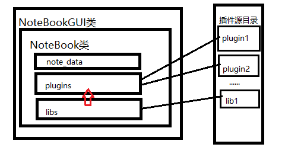
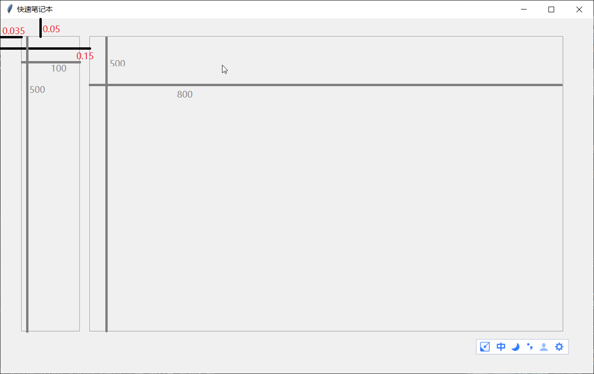

# 多功能笔记本

- 名称: `多功能笔记本`

- 主程序: `program.py`

- 库:`proglib`

- `.config.json`和`.plugin`:程序配置文件和插件文件夹

## 介绍
>
> 本程序使用`tkinter`及`easygui`库作为界面程序. 设计中将使用插件设计, 通过加载一个默认文件夹和可选文件夹内的插件使用.
>
> 本程序的功能通过加载一个或多个插件实现. `proglib` 库只实现 GUI页面 和 `NoteBook`类以 实现程序主体
>
> 因为本程序使用插件设计, 可以对程序的功能进行拓展, 所以起名为 `多功能笔记本`
>
> 由于本程序使用插件设计,所有运行效果在不修改核心库`(proglib)`的仍有提升空间
>
## 菜单

- `文件`: 包括 `新建` `打开` `保存` `另存为` `退出`

- `工具`: 插件菜单

- `配置`: 目前用于加载插件,可查看已加载插件

## 插件介绍

- `文本编辑器`: 可打开多个文件,直接在复选框输入可新建文件

- `变量编辑器`: 可编辑变量组,两个复选框分别对应变量组/变量,直接在复选框输入可新建文件

- `变量运算器`: 加载变量组,可对变量组进行运算,运算结果存储在变量组中

- `迭代执行工具`: 执行迭代操作,可将结果保存为变量组

### 代码

> 本程序使用插件化设计, 默认插件目录位于`./.plugins`, 文件夹路径采用软编码存储在`./.config.json`中
>
#### 主体

> 本程序的主要构成由`NoteBook`类 和 `NotebookGUI`类 构成.
>
> `NoteBook`类 为主要的功能实现. 包括 加载插件, 存储笔记数据.
>
> `NotebookGUI`类 为 GUI 类, 此类必有一个`NoteBook`类作为其`notebook`属性, 使用户界面与内部相连
>
>

#### 插件加载

> 本程序主体`(proglib)`使用`exec`函数执行一段代码,将插件以库的方式导入
>
> 若为功能型插件,则在导入后加载插件内的运行类
>
> 若为支持库,则将支持库对象存储到一个字典中,功能型插件可调用库

---

### [Book 部分](./proglib/book.py)

#### `Notebook`类

>笔记本类,程序主要部分
>
> `NoteBook.text`:笔记本文字内容,可作为插件的作用域
>
> `NoteBook.var_group`:笔记本的变量组,可作为插件的作用域
>
>`NoteBook.save`:保存路径
>
>`NoteBook.plugins`:笔记本插件字典,格式为`PluginName:NBPlugin`
>
>`NoteBook.output_save`:笔记本内容输出函数
>
>`NoteBook.history_set`:历史加载函数
>
>`NoteBook.save_set`:输出设置
>
>`NoteBook.plugin_set`:插件设置

### `NBPlugin`类

插件类,用于存储插件

### `NBText`类

> 笔记本文字类,用于存储笔记本文字内容
>
> `NBText.text`:笔记本文字内容
>
> `NBText.save`:保存/输出 函数
>
> `NBText.input`: 输入函数
>
> `NBText.input`:输入函数

### `NBVar`类

> 笔记本变量类,用于存储笔记本变量
>
> `NBVar.name`: 变量值
>
> `NBVar.value`: 变量值
>
> `NBVar.input`: 输入函数

### `NBVarGruop` 类

> 笔记本变量组类,用于存储笔记本变量组,变量组为一个字典,每个 键值对为一个`NBVarGroup`类
>
> `NBVarGruop.vars`: 变量组
>
> `NBVarGruop.load_json`: 加载JSON文件
>
> `NBVarGruop.dict_output`: 输出为 字典
>
> `NBVarGruop.add`: 添加变量

## `Var2json` 模块

> 用于将变量组转换为JSON格式
>
> `var2json.NBJsonDecoder`: 解码器
>
> `var2json.NBJsonEncoder`: 编码器

### [GUI 部分](./proglib/book.py)

>
>
#### `NoteBookGUI`类

> 程序主窗口类
>
> `NoteBookGUI.notebook`:一个`NoteBook`对象
>
>`NoteBookGUI.root`:一个`tkinter.Tk`对象,作为主窗口
>
>`NoteBookGUI.defaultconfig`:程序默认配置
>
>`NoteBookGUI.config`:程序当前配置
>
> `NoteBookGUI.option_menu`:菜单栏
>
> `NoteBookGUI.proglibFrame`:主页面
>
>`NoteBookGUI.config_set`:设置配置
>
>`NoteBookGUI.config_input`:检查配置正确并输入
>
>`NoteBookGUI.menu_init`:初始化菜单栏
>
>`NoteBookGUI.windows_init`:初始化窗口
>
>`NoteBookGUI.run`:运行 GUI 窗口

### 插件部分

插件为程序功能实现的方式,见 [plugin_docs.md](./plugin_docs.md)

### 笔记保存

笔记保存格式见[note_save_docs.md](./note_save_docs.md)

本项目所有权归 卢茂宸 所有
